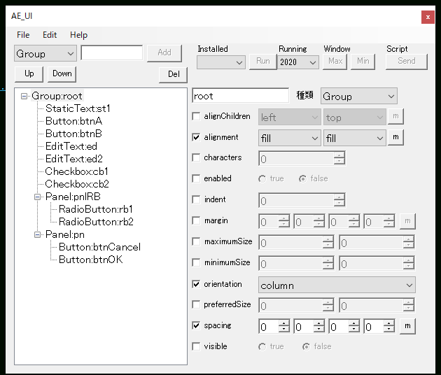

# AE_UI
After Effects スクリプトでリソース形式でUIを作る時に使うツールです。  
  
僕自身リソース形式での記述がよくわからなかったので作ったものです。
  

## Usage

リソース記述がわからなうと使えません  

公式のドキュメント  
https://extendscript.docsforadobe.dev/user-interface-tools/resource-specifications.html#resource-specifications  
  
さかもとのサイト  
https://sites.google.com/view/youuu4/HowToWrite?authuser=0  
  

起動すると以下のフォームが表示されます。  
  
  
 左上のドロップダウンから作りたいUIを選び、名前を入力してAddで追加されます。  
あとは、選択して右のパネルで編集してください。  
  
右上のRunningで起動中のAEを選び、Sendボタンでプレビューが表示されます。  
Fileメニューの「jsx disp」でスクリプトの内容が表示されるので、後は適当に加工してください。  

## License
This software is released under the MIT License, see LICENSE. 

## Authors

bry-ful(Hiroshi Furuhashi)  
twitter:[bryful](https://twitter.com/bryful)  
bryful@gmail.com  

# References
